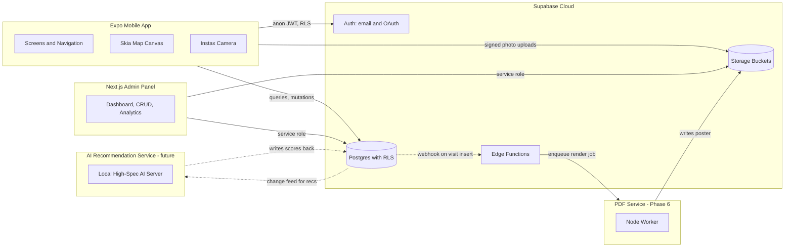
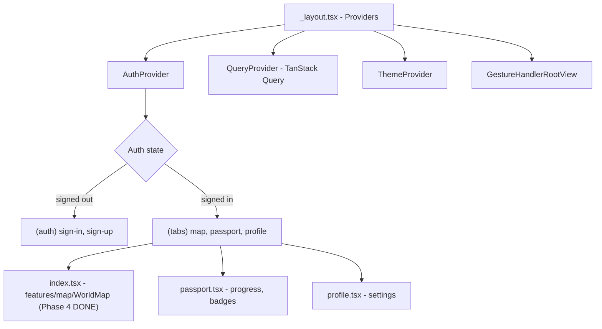
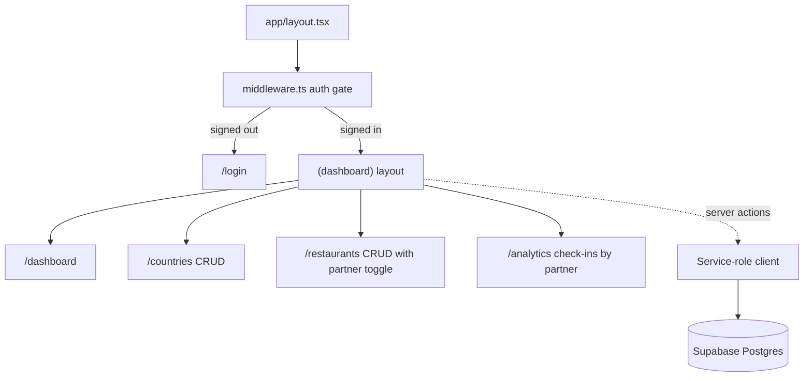
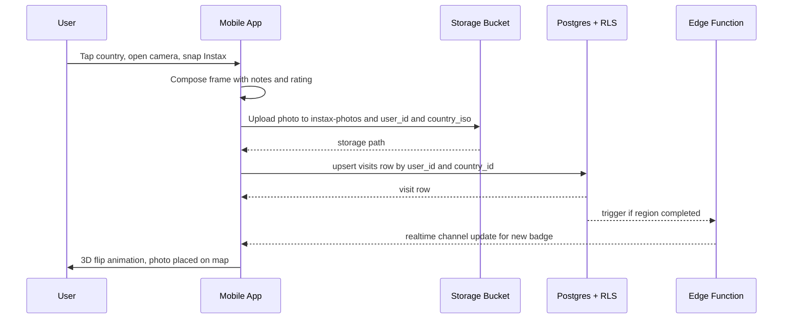

# GastroVoyage — System Architecture

> Phase 1 baseline document. Phase 4 (Skia map) is implemented; later phases (camera, PDF, AI) are pending.

## 1. Product summary

GastroVoyage is a gamified "Food Passport" — a couple or group tracks their journey through world cuisines. Each country gets one Instax-style polaroid pinned onto a stylized vintage world map. When the map fills up, the user can generate a 300dpi A2 PDF poster to frame.

Monetization is B2B: the platform owner registers "Partner Restaurants" via an admin panel. When a user explores a cuisine, partner restaurants are recommended, and GPS check-ins are tracked for commission billing.

## 2. High-level system

## 3. Module boundaries (the rules)

1. **The mobile app never imports server-only code.** No service-role keys, no Node-only libraries.
2. **`packages/shared` is the single source of truth** for database types (`types.generated.ts`), domain models, country data, and theme tokens. Both apps consume it.
3. **The admin panel uses service-role only inside server actions/route handlers.** Client components get the anon key.
4. **The PDF service and AI module are decoupled** behind Edge Function HTTP triggers. Phase 1 stubs them; later phases swap in real workers without touching the mobile/admin code.
5. **RLS is mandatory** on every user-data table. Even the service role respects table grants — we don't disable RLS, we use admin policies that check JWT role claims.

## 4. Mobile app architecture

- **Routing:** `expo-router` (file-based). Auth gate is implemented in the root `_layout.tsx` via redirect.
- **State:**
  - Server state → TanStack Query, keyed on user id.
  - Auth state → React context fed by `supabase.auth.onAuthStateChange`.
  - Ephemeral UI → local component state.
- **Storage:** `@react-native-async-storage/async-storage` for the Supabase session.
- **Styling:** NativeWind (Tailwind for RN). Theme tokens come from `@gastrovoyage/shared/constants/theme`.

## 5. Admin panel architecture

- **Framework:** Next.js 14 App Router, all data fetching in React Server Components and server actions.
- **Auth:** `@supabase/ssr` with cookie-based sessions. `middleware.ts` redirects unauthenticated requests off `/(dashboard)/*`.
- **Authorization:** admin role is encoded in `auth.users.app_metadata.role = 'admin'` and enforced by RLS policies (`is_admin()` helper).

## 6. Data flow: "log a visit" (planned for Phase 5)

## 7. Tech stack inventory

| Layer | Choice | Why |
|-|-|-|
| Mobile framework | Expo SDK 52, RN 0.76 | Managed workflow, fast iteration, OTA updates |
| Language | TypeScript strict | Type safety, shared types via monorepo |
| Mobile styling | NativeWind 4 | Tailwind ergonomics on RN |
| Mobile animation | Reanimated 3 + Lottie | Native-thread animations |
| Map | React Native Skia | Fully custom vintage canvas, no Mapbox key needed |
| Mobile navigation | expo-router | File-based, deep-link friendly |
| Mobile data | TanStack Query | Cache, retries, optimistic updates |
| Admin framework | Next.js 14 App Router | RSC, server actions, SEO-irrelevant but matches stack |
| Admin styling | Tailwind + shadcn-style primitives | Consistent design tokens with mobile |
| Backend | Supabase | Postgres + Auth + Storage + Edge Functions in one |
| Database | PostgreSQL 15 (Supabase) | Relational, RLS, full-text search later |
| PDF | Node service + Puppeteer/Skia | Phase 6 — runs out-of-process so a render can't slow the API |
| Monorepo | pnpm workspaces | Fast, disk-efficient, native workspace support |

### Why pnpm with `node-linker=hoisted`

Expo's Metro bundler and React Native's autolinking don't fully understand pnpm's nested symlink layout. We use `node-linker=hoisted` (set in `.npmrc`) so dependencies are flattened into `node_modules/` like npm. We still get pnpm's speed and workspace protocol (`workspace:*`).

## 8. Security model

- **Anon key** ships in the mobile app and admin browser bundle — it is safe because every table has RLS.
- **Service-role key** lives only in:
  - The admin panel's server actions and route handlers (process env `SUPABASE_SERVICE_ROLE_KEY`).
  - The PDF service (Phase 6).
- **Storage policies:**
  - `instax-photos` (private) — users can only read/write paths prefixed with their own `auth.uid()`.
  - `restaurant-images` (public read) — admin writes, all read.
  - `map-exports` (private) — PDF service writes, mobile app reads via signed URL with 24h expiry.
- **JWT claims:** admin status is set via `app_metadata.role = 'admin'` (cannot be modified by the user, unlike `user_metadata`).

## 9. Future-proofing for AI recommendations

The PRD calls out a future "high-spec local AI server" for recommendations. To keep that path open:

- Restaurant data lives in regular tables with embeddings-friendly columns (we'll add `pgvector` extension later).
- All user behavior signals (visits, check-ins) are first-class rows with timestamps — easy to stream into a feature pipeline.
- The mobile app fetches recommendations via a thin Edge Function endpoint, not a hardcoded query. Swapping the implementation behind that endpoint requires no client changes.

## 10. What Phase 1 explicitly does NOT include

- Skia map canvas (Phase 4)
- Instax camera + photo upload pipeline (Phase 5)
- Restaurant recommendation UI + GPS check-in (Phase 6)
- PDF generation service (Phase 6/7)
- Admin CRUD forms and analytics charts (the shell exists, the pages are placeholders)
- Lottie animations, badge artwork, sound effects, haptics tuning
- Push notifications, deep links, OTA updates
